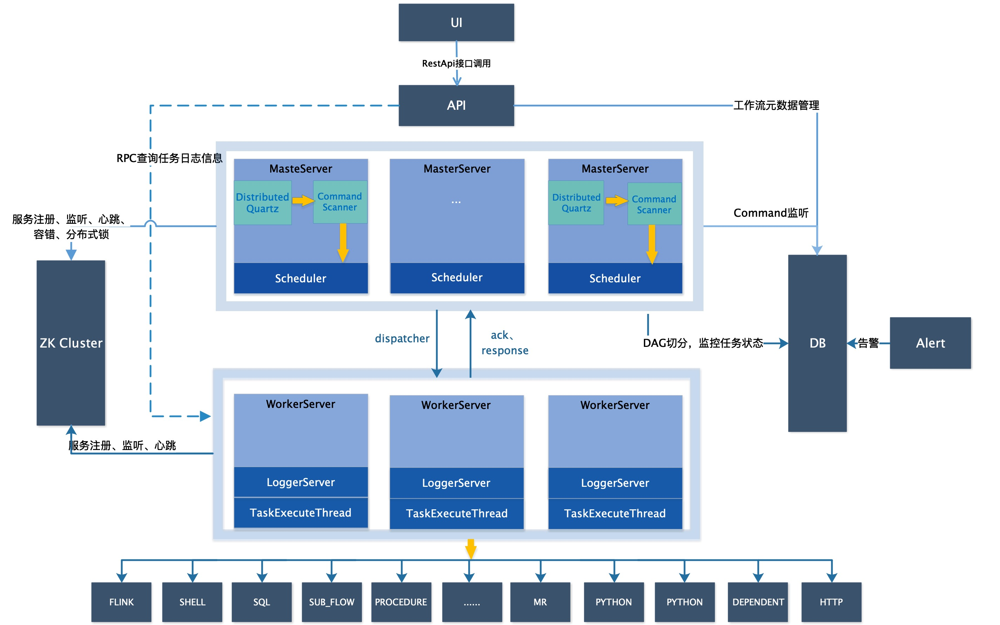

# Dolphin Scheduler 简介
## 整体架构

### 前端
- UI 通过restful API 与后端交互

### 后端
后端包括 4个组件 共享DB 和RDS.

- API 提供UI 操作的Restful 接口。
- Master 负责工作流的定期调度、工作流流转和逻辑节点执行。
- Worker

dolphin scheduler 

### 功能介绍

### 状态机轮转

#### Workflow 状态机轮转

| 状态 (State) | onStartEvent | onTopologyLogicalTransitionEvent | onPauseEvent | onPausedEvent | onStopEvent | onStoppedEvent | onSucceedEvent | onFailedEvent | onFinalizeEvent |
|:---:|:---:|:---:|:---:|:---:|:---:|:---:|:---:|:---:|:---:|
| Running      |triggerTasks()| triggerSuccessors()| transfrom(ReadyStop)&&pauseActiveTask() | X | transfrom(ReadyStop) &&killActiveTask() |workflowFinish(STOP)|  workflowFinish(SUCCESS) |  workflowFinish(FAILED) | X |
| ReadyStop    |triggerTasks()| triggerSuccessors()| X | workflowFinish(PAUSE) | X |X|  workflowFinish(SUCCESS) |  workflowFinish(FAILED) | X |
| ReadyPause   |triggerTasks()| triggerSuccessors()| X | X | killActiveTask() |workflowFinish(STOP)|  workflowFinish(SUCCESS) |  workflowFinish(FAILED) | X |
| Paused       | X | X | X | X | X | X | X | X | finalizedAction() |
| Stopped      | X | X | X | X | X | X | X | X | finalizedAction() |
| Success      | X | X | X | X | X | X | X | X | finalizedAction() |
| Failed       | X | X | X | X | X | X | X | X | finalizedAction() |
| Failover     | X | X | X | X | X | X | X | X | X |
| SerialWait   | X | X | X | X | X | X | X | X | X |
| Submitted    | X | X | X | X | X | X | X | X | X |

#### Task 状态机轮转

| 状态 (State) | onStartEvent | onStartedEvent | onRuntimeContextChangedEvent | onRetryEvent | onDispatchEvent | onDispatchedEvent | onPauseEvent | onPausedEvent | onKillEvent | onKilledEvent | onFailedEvent | onSucceedEvent | onFailoverEvent |
|:---:|:---:|:---:|:---:|:---:|:---:|:---:|:---:|:---:|:---:|:---:|:---:|:---:|:---:|
| Submitted   | accuireResource() && publish(TaskDispatch) | X | updateTaskRuntimeContext()|X | DelayExecution Or task.dispatch()| persistToDB() | removeTask Or retry() | persistToDB() && publish(WorkflowTopologyTransition) | removeTask Or retry() | persistToDB() && publish(WorkflowTopologyTransition)  | retry() Or persistToDB() && publish(WorkflowTopologyTransition)  | X | X |X|
| DelayExecution       | accuireResource() && publish(TaskDispatch) | X | updateTaskRuntimeContext() |X | DelayExecution Or task.dispatch()| persistToDB() | removeTask Or retry() | persistToDB() && publish(WorkflowTopologyTransition) | removeTask Or retry() | persistToDB() && publish(WorkflowTopologyTransition)  | retry() Or persistToDB() && publish(WorkflowTopologyTransition)  | X | X |X|
| Dispatch(Dispatched) | publish(TaskFailover) | persistToDB() | updateTaskRuntimeContext() | X | X |  X | task.pause() | persistToDB() && publish(WorkflowTopologyTransition) | task.kill() | persistToDB() && publish(WorkflowTopologyTransition) | retry() Or persistToDB() && publish(WorkflowTopologyTransition)  | persistToDB() && publish(WorkflowTopologyTransition)  |task.failover() |
| Running      |X |  persistToDB() | updateTaskRuntimeContext() | X | X |  X | task.pause() | persistToDB() && publish(WorkflowTopologyTransition) | task.kill() | persistToDB() && publish(WorkflowTopologyTransition) | retry() Or persistToDB() && publish(WorkflowTopologyTransition)  | persistToDB() && publish(WorkflowTopologyTransition)  |task.failover() |
| Pause      | publish(WorkflowTopologyTransition) | X | updateTaskRuntimeContext() | X | X | X | X | | X | X | X | X | X | X |
| Kill       | publish(WorkflowTopologyTransition) | X | updateTaskRuntimeContext() | X | X | X | X | | X | X | X | X | X | X |
| Failure     | X | X | updateTaskRuntimeContext()| X | X | X | X | X | X | X | X | X | X | X |
| Success     |  persistToDB() && publish(WorkflowTopologyTransition) | X | updateTaskRuntimeContext() | X | X | X | X | X | X | X | X | X | X | X |
| ForceSuccess|  persistToDB() && publish(WorkflowTopologyTransition) | X | updateTaskRuntimeContext() | X | X | X | X | X | X | X | X | X | X | X |
| Failover    | X | X | X | X | X | X | X | X | X | X | X | X |  X |

TODO 剩余 failure 没有完成 failure 需要完成